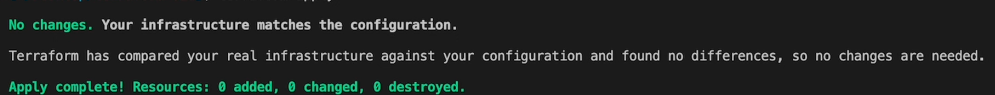

# Infrastructure as Code - Terraform

Infrastructure as Code (IaC) is a methodology that uses code to define, provision, and manage infrastructure in a repeatable and consistent manner. Terraform, developed by HashiCorp, is one of the leading tools for implementing IaC, allowing users to define their infrastructure using a high-level configuration language called HCL (HashiCorp Configuration Language).


## Key Features of Terraform:

- Multi-Cloud Support: Terraform supports a wide range of cloud providers like AWS, Google Cloud, Azure, and others, allowing you to manage resources across different platforms with a unified tool.

- State Management: Terraform maintains a state file that tracks the current state of your infrastructure, allowing it to understand the differences between your configuration and the real-world resources.

- Declarative Configuration: You describe the desired state of your infrastructure in Terraform configuration files, and Terraform takes care of creating, updating, or destroying resources to match that state.

- Infrastructure Automation: By automating the provisioning and management of infrastructure, Terraform reduces manual processes, minimizes human error, and speeds up deployments.

- Reusable Modules: Terraform supports modules, which are reusable components that can be shared and used across multiple projects, enhancing consistency and efficiency.

- Dependency Graph: Terraform automatically understands the dependencies between resources and ensures they are created, updated, or destroyed in the correct order.


## How to Use Terraform

[Install Terraform](https://developer.hashicorp.com/terraform/tutorials/aws-get-started/install-cli#install-terraform)

```bash
# macos
brew tap hashicorp/tap
brew install hashicorp/tap/terraform
brew cleanup terraform

terraform -help
```

Download Provider
```bash
terraform init
```

- Write Configuration Files: Define your infrastructure resources using HCL. 

- Initialize the Project: Run terraform init to initialize the working directory and download the required provider plugins.

- Plan Changes: Use terraform plan to preview the changes that Terraform will make to your infrastructure based on your configuration.

- Apply Changes: Run terraform apply to create or update the resources as defined in your configuration files.

- Manage State: Terraform manages a state file that keeps track of resources, ensuring that the current infrastructure aligns with your configuration.


### Providers in Terraform
Providers are fundamental components in Terraform that define and interact with the specific APIs of various cloud platforms, services, and other APIs. A provider is essentially a plugin that enables Terraform to manage and provision resources on a particular platform, such as AWS, Azure, Google Cloud, Kubernetes, GitHub, and many more. Providers are responsible for understanding API interactions and exposing resources for Terraform to manage.

- Resource Management: Providers manage the creation, updating, and deletion of resources within a specified platform. For example, the AWS provider can manage EC2 instances, S3 buckets, RDS databases, and more.

- Configuration: Each provider must be configured in your Terraform files, typically specifying details such as authentication credentials, the target region, and any specific settings needed to connect to the service.

- Multiple Providers: Terraform can use multiple providers within the same configuration, allowing you to manage resources across different platforms simultaneously (e.g., deploying resources on AWS and Azure within a single Terraform project).

- Versioning: Providers are versioned, and you can specify which version of a provider to use to ensure stability and compatibility in your infrastructure.


## Prepare AWS CLI

Install or update the AWS CLI - [Link](https://docs.aws.amazon.com/cli/latest/userguide/getting-started-install.html)


```bash
aws configure
```

Enter your AWS Access Key, and AWS Secret Key
Enter Default region name, output format

```bash
cd ~/.aws

# default profile
cat credentials
```

### Terraform AWS

[AWS Provider](https://registry.terraform.io/providers/hashicorp/aws/latest/docs)


Deploy to AWS
```bash

terraform apply
```




Get ride of instances

``` bash
terraform destroy
```

Override default value

```bash
terraform apply -var "instance_name=MyNewNameEC2"
```

Variable file (terraform.tfvars) can replace default variable.

```tf
# EC2
ec2_instance_type = "t2.micro"
instance_name     = "MyInstanceNameFromFile"

```

### Output Data

```tf
output "instance_id" {
  description = "ID of the EC2 instance"
  value       = aws_instance.app_server.id
}

output "instance_public_ip" {
  description = "Public IP address of the EC2 instance"
  value       = aws_instance.app_server.public_ip
}

```


```bash
terraform apply
terraform output
```


### Sensitive Information
Always use secure methods such as environment variables, secrets management services (like AWS Secrets Manager or HashiCorp Vault), or encrypted storage solutions.